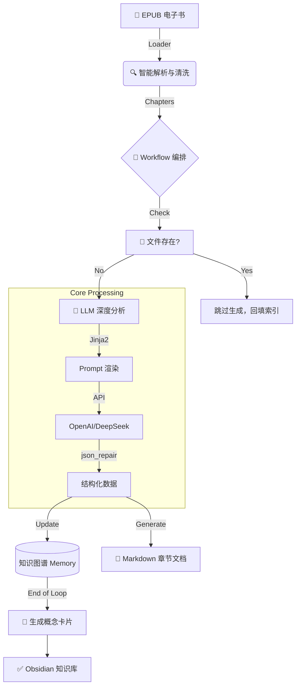

---

# 🧠 AI 深度研读与知识图谱构建系统
### —— 基于 《毛主席教我们当省委书记》 的数字化认知实验

> **Project: Mao Thought & Philosophy Knowledge Base Builder**
> 
> 一个基于 LLM (Large Language Model) 的自动化知识工程系统。它不仅仅是一个电子书阅读器，更是一个**“虚拟战略顾问”**。它能够像解剖麻雀一样深度研读经典著作，提取思维模型，构建知识图谱，并生成可交互的 **Obsidian** 数字花园。

---

## ✨ 核心亮点 (Key Features)

*   **🕵️‍♂️ 深度历史还原 (Context-Aware RAG)**
    *   拒绝平铺直叙的摘要。系统内置“首席战略顾问”人格，在分析每一章时，会自动还原当时的**历史场域**（如苏共二十大、反冒进等），结合**辩证法**与**认识论**进行深度解码。
    *   具备**全局记忆 (Global Memory)**，在分析后文时能自动关联前文提到的概念（如“赫鲁晓夫”、“修正主义”）。

*   **🕸️ 动态知识图谱 (Dynamic Knowledge Graph)**
    *   **概念提取**：自动从文本中提炼“核心概念”与“思维模型”（如`[[解剖麻雀]]`、`[[价值锚]]`）。
    *   **双向链接**：生成的 Markdown 文件包含 Obsidian 标准的 `[[WikiLink]]`，自动构建章节与概念之间的网状联系。
    *   **概念卡片**：自动生成独立的 `concepts/*.md` 卡片，形成原子化的知识库。

*   **🛡️ 工业级鲁棒性 (Robustness)**
    *   **断点续传**：运行中断也不怕。系统会自动检测已生成的文件，跳过 API 调用，仅进行索引回填，既省钱又省时。
    *   **自动修复**：引入 `json_repair`，自动修正大模型输出的非法 JSON（如未转义引号、截断等）。
    *   **智能清洗**：自动清洗文件名中的非法字符和引号，确保跨平台兼容性。

*   **📝 完美的 Obsidian 体验**
    *   **原文折叠**：保留原书排版，点击 `<details>` 即可展开对照阅读。
    *   **YAML 元数据**：包含 `tags`、`summary`、`order`，支持 Dataview 插件查询。
    *   **底部导航**：自动生成“上一章/下一章”跳转链接，且逻辑与文件名严格统一。

---

## 🏗️ 系统架构 (Architecture)

项目遵循 **ETL (Extract, Transform, Load)** + **RAG** 的架构设计：



---

## 🛠️ 安装与配置 (Installation)

本项目使用 **Poetry** 进行依赖管理。

### 1. 克隆项目
```bash
git clone <your-repo-url>
cd mao_thought_and_philosophy
```

### 2. 安装依赖
```bash
poetry install
```

### 3. 配置环境变量
在项目根目录创建 `.env` 文件，填入你的大模型 API Key（推荐使用 DeepSeek 或 OpenAI）：

```ini
# .env 文件
LLM_API_KEY=AI********************************
LLM_BASE_URL=https://generativelanguage.googleapis.com/v1beta/openai/  
LLM_MODEL=gemini-2.5-flash
```

### 4. 准备书籍
将你的 `.epub` 书籍文件放入 `src/mao_thought_and_philosophy/assets/` 目录下。
*   默认文件名：`毛主席教我们当省委书记.epub`

---

## 🚀 运行 (Usage)

确保一切准备就绪后，运行主程序：

```bash
# 在项目根目录下运行
python -m src.mao_thought_and_philosophy.main
```

**运行过程预览：**
```text
🚀 系统初始化...
✅ 配置校验通过
📖 正在解析《毛主席教我们当省委书记》...
🧠 已加载现有知识图谱：包含 15 个概念
📚 共识别出 33 个章节，开始构建知识库...

⏩ [已存在，跳过] 01_省委第一书记要抓理论工作.md
⚡ [10/33] 正在深度研读：文件、文章、讲话要准确、鲜明、生动 ...
...
✅ 全部完成！知识库已生成在：.../output/knowledge_base
```

---

## 📂 输出目录结构 (Output)

运行完成后，`output/knowledge_base` 目录即为一个完整的 Obsidian 仓库：

```text
output/knowledge_base/
├── 00_全书概览_Index.md        # 自动生成的目录索引表
├── knowledge_graph.json       # 知识图谱源数据 (JSON格式)
├── chapters/                  # 深度研读后的章节笔记
│   ├── 01_省委第一书记要抓理论工作.md
│   ├── 02_在路线问题上要戒左戒右.md
│   └── ...
└── concepts/                  # 自动生成的概念卡片
    ├── 解剖麻雀.md
    ├── 价值锚模型.md
    └── ...
```

---

## 📖 Obsidian 食用指南

为了获得最佳体验，请使用 **[Obsidian](https://obsidian.md/)** 打开 `output/knowledge_base` 文件夹。

推荐安装以下 Obsidian 插件：
1.  **Dataview**：利用 YAML 元数据生成动态表格。
2.  **Graph View** (内置)：查看全书知识关联图谱。

**知识图谱效果：**
你将看到一张网状图，`[[解剖麻雀]]` 等核心概念作为节点，连接了全书不同的章节，直观展示了毛泽东思想体系的内在逻辑。

---

## 👨‍💻 技术栈 (Tech Stack)

*   **Language**: Python 3.10+
*   **LLM Integration**: OpenAI SDK (Compatible with DeepSeek)
*   **Prompt Engineering**: Jinja2 (Templates)
*   **Data Parsing**: EbookLib, BeautifulSoup4
*   **Data Structure**: NetworkX (Graph Logic), JSON
*   **Robustness**: json_repair, python-dotenv

---

## 📜 License

MIT License